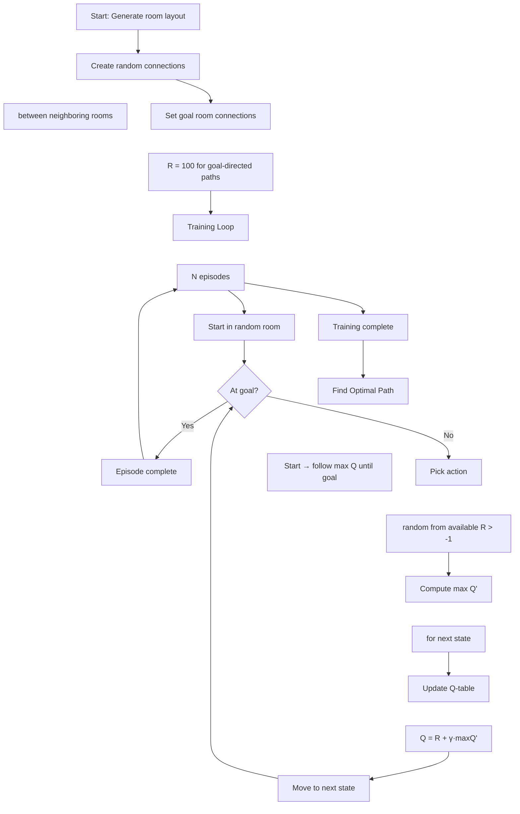
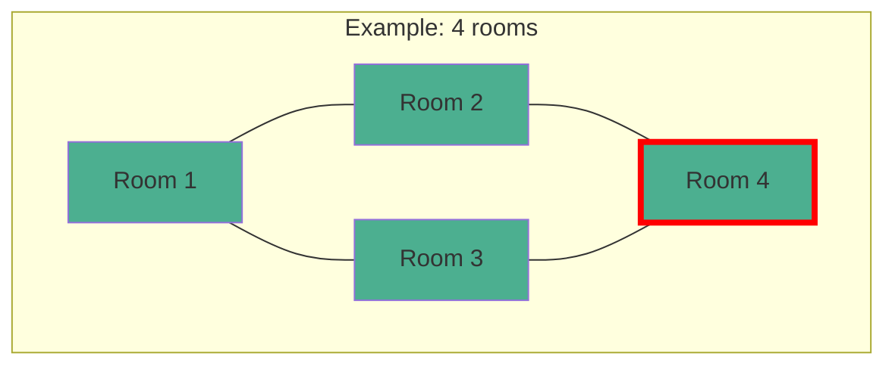

# Q-Learning Reinforcement

**Q-Learning reinforcement learning agent visualization in C# WinForms. An agent learns optimal paths through a randomly-connected room environment using temporal difference learning.**

## Features

- **Room-Based Environment**: Configurable number of rooms graphically arranged in a grid layout
- **Random Path Generation**: Bidirectional paths between neighboring rooms created randomly
- **Q-Learning Agent**: Tabular Q-Learning with epsilon-greedy exploration
- **Visual Training**: Click to train the agent over multiple episodes
- **Path Display**: After learning, click to find and visualize the optimal path from start to goal
- **Step-by-Step Path Log**: Rich text box shows the sequence of rooms traversed

## Project Structure

```
q-learning-reinforcement/
├── QLearning_1.sln
├── QLearning_1/
│   ├── Form1.cs              # Main form: environment, Q-learning, visualization
│   ├── Form1.Designer.cs     # Designer-generated layout
│   ├── Program.cs            # Application entry point
│   └── Properties/
│       ├── AssemblyInfo.cs
│       ├── Resources.Designer.cs
│       └── Settings.Designer.cs
└── README.md
```

## System Architecture

```mermaid
flowchart TD
    subgraph Environment
        A1[Room Layout]
        A2[Grid-based positions]
        A1 ~~~ A2
        B1[Reward Matrix R(s,a)]
        B2[-1: no connection]
        B3[0: connected]
        B4[100: goal connection]
        B1 ~~~ B2
        B2 ~~~ B3
        B3 ~~~ B4
    end
    
    subgraph Agent
        C1[Q-Table Q(s,a)]
        C2[Initialized to 0]
        C1 ~~~ C2
        D1[Epsilon-greedy]
        D2[Action Selection]
        D1 ~~~ D2
        E1[Q-Value Update]
        E2[Q = R + γ·maxQ']
        E1 ~~~ E2
    end
    
    subgraph Visualization
        F1[Room Circles]
        F2[with numbers]
        F1 ~~~ F2
        G1[Path Lines]
        G2[Blue: connections]
        G3[Red: chosen path]
        G1 ~~~ G2
        G2 ~~~ G3
        H1[Path Log]
        H2[Text output]
        H1 ~~~ H2
    end
    
    A1 --> B1
    B1 --> C1
    C1 --> D1
    D1 --> E1
    E1 --> C1
    C1 --> G1
    C1 --> H1
    F1 --> G1
```

## Core Concepts

### Q-Learning

Q-Learning is a **model-free reinforcement learning** algorithm. The agent learns an optimal policy by interacting with the environment:

$$Q(s_t, a_t) \leftarrow Q(s_t, a_t) + \alpha \left[ R(s_t, a_t) + \gamma \max_{a'} Q(s_{t+1}, a') - Q(s_t, a_t) \right]$$

Where:
- **Q(s, a)**: Expected future reward for taking action `a` in state `s`
- **R(s, a)**: Immediate reward for action `a` in state `s`
- **α (alpha)**: Learning rate (how much new info overrides old)
- **γ (gamma)**: Discount factor (importance of future rewards)

Since this implementation uses `α = 1` (no learning rate parameter in the update formula), the simplified update becomes:

$$Q(s, a) = R(s, a) + \gamma \max_{a'} Q(s', a')$$

### Reward Matrix (R Table)

The R table defines the environment's reward structure:
- **R[s, a] = -1**: No connection between room `s` and room `a`
- **R[s, a] = 0**: Connected rooms (regular transition)
- **R[s, a] = 100**: Connection that leads directly **to the goal room**

### Algorithm Flow



### Environment Layout

Rooms are arranged in a grid. Each room has up to 8 neighbors (cardinal + diagonal). The system randomly determines which connections exist (50% probability per potential connection).



### Key Data Structures

| Structure | Description |
|---|---|
| `yTablosu[,]` | `Yer[]` grid mapping rooms to pixel positions |
| `R_Tablosu[,]` | Reward matrix: R[from, to] = -1/0/100 |
| `Q_Tablosu[,]` | Q-value matrix learned during training |
| `Yer` class | Stores room `X`, `Y` pixel coordinates and `Deger` (room number) |

### Learning Process

1. Random start room selected
2. Agent picks an available action (room it's connected to)
3. If the next room connects to goal, reward is 100
4. Q-value updated using the Bellman equation
5. Repeat for configured number of episodes

### Path Finding

After training, to find the optimal path from start to goal:
1. Start at the given room
2. Select the action (next room) with the **highest Q-value** among connected rooms
3. Move to that room and repeat
4. Stop when reaching the goal

## How to Use

1. Configure number of rooms using numeric up-down
2. Set the goal room number
3. Set the start room number
4. Enter a learning rate (α)
5. Rooms and random connections are automatically drawn
6. Set the number of training episodes
7. Click **"Öğrenmeyi Başlat"** (Start Learning) to train
8. Click **"Yolu Bul"** (Find Path) to visualize the optimal route

## Building

Open `QLearning_1.sln` in Visual Studio 2008+ (retarget .NET Framework if needed) and build.
